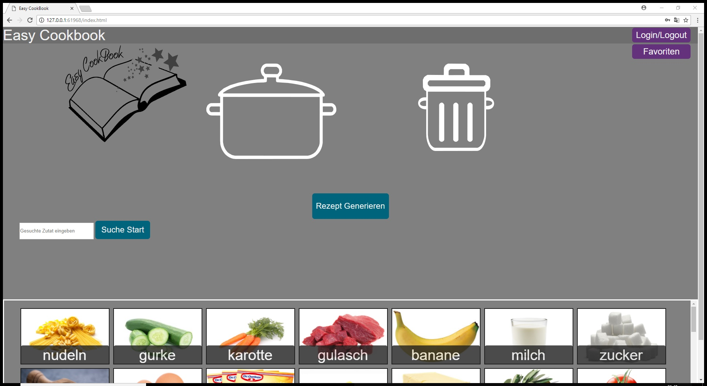
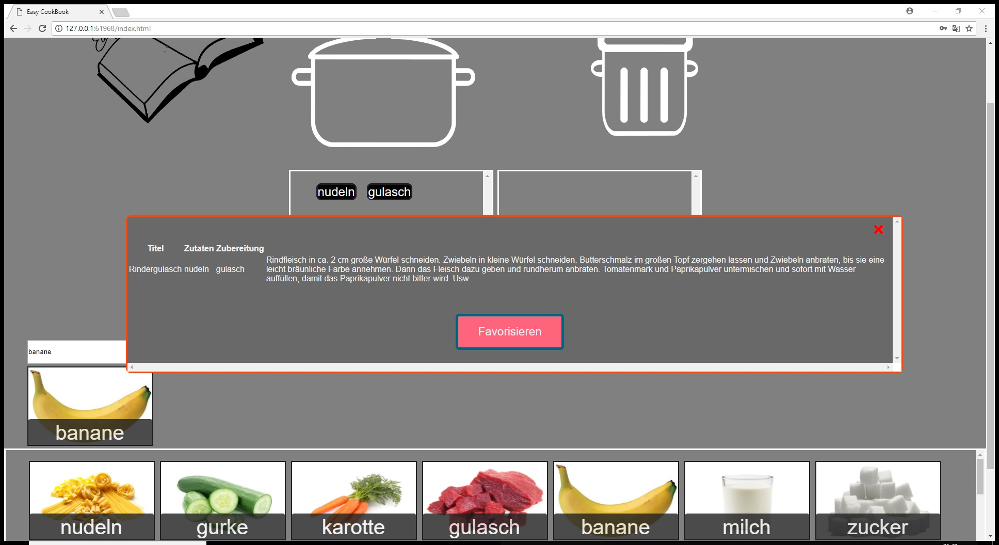

# Abschlussprojekt: Easy Cookbook

Easy Cookbook ist für experimentierfreudige Köche, die einfach und auf interaktive Art neue Rezepte mit bestimmten Zutaten ausprobieren wollen. Die Zutaten und Rezepte werden von [Wikimedia Cookbook](https://en.wikibooks.org/wiki/Cookbook:Table_of_Contents) geholt. Je nach den persönlichen Vorlieben kann ein passendes Rezept aus ausgewählten Zutaten selbst zusammengestellt werden. Dabei werden Zutaten interaktiv per Drag and Drop ausgewählt oder ausgegrenzt, je nachdem ob diese im Rezept vorkommen sollen oder nicht. Sollte man Gefallen an einem Rezept finden, kann man dieses favorisieren. Dafür und zur Bewertung von Rezepten kann man einen Nutzeraccount erstellten, auf dem favorisierte und bewertete Rezepte später gespeichert werden können.

## Screenshots der Anwendung

Der erste Screenshot zeigt die Hauptseite der Anwendung nach der Anmeldung. Dort ist rechts oben ein Login/Logout-Button, mit dem man auf die Login-Seite kommt auf der man sich registrieren, einloggen und ausloggen kann. Um die Hauptseite zu erreichen muss man sich vorher einloggen. Darunter ist der Favoriten-Knopf, der eine List der für den Nutzer gespeicherten Favoriten zeigt. Der Kochtopf und die Mülltonne stellen die Elemente da, in die man die einzelnen Zutaten ziehen kann. Die Zutaten sind unten auf dem Bild zu sehen und wurden vorher aus der Datenbank entnommen. Man kann durch die Zutaten scrollen, und gewünschte Zutaten oben in den Topf oder den Mülleimer ziehen. Über der Zutatenliste befindet sich ein Suchfeld. Dort können Namen von Zutaten in Kleinbuchstaben eingegeben werden und das Entsprechende Zuaten-Element wird dann unter der Suche angezeigt sofern es vorhanden ist. 

Der zweite Screenshot zeigt die Rezeptanzeigt, falls ein Rezept gefunden wurde. Um ein Rezept zu finden werden Zutaten in den Topf oder den Mülleimer gezogen. Es müssen zwei Zutaten im Topf sein um die Suche zu beginnen. Sollte ein Rezept die zwei Zutaten enthalten wird es angezeigt, außer eine Zutat aus dem Mülleimer ist auch im Rezept enthalten, da der Mülleimer dazu da ist um ungewünschte Zutaten in Rezepten zu vermeiden (z.B. Fleisch wenn man Vegetarier ist). Die aktuellen Zutaten im Topf werden mit schwarzem Hintergrund angezeigt und können mit einem Knopfklick darauf wieder entfernt werden. Ist die Liste leer verschwindet auch die Anzeige der im Kochtopf oder Mülleimer befindlichen Elemente. Hat man ein Rezept, das man favorisieren will, klickt man auf den entsprechenden Knopf und das Rezept wird als Favorit für den jeweiligen Nutzer in der Datenbank gespeichert. Ein Klick auf das rote Kreuz schließt das Anzeigefenster für das Rezept.

Der dritte Screenshot zeigt die Favoritenanzeige. Dort kann man favorisierte Rezepte sehen und diese je nach Vorliebe bewerten. Auch dieses Fenster kann mit einem Klick auf das rote Kreuz geschlossen werden. Angezeigt werden die Favoriten für den jeweiligen Nutzer, wenn dieser oben auf den Favoriten-Knopf klickt.  

## Features

**Rezepte mit Zutaten suchen** 
Der Nutzer kann per Drag and Drop Zutaten in einen Topf ziehen und erhält dann Rezepte, die diese Zutaten enthalten. Die Rezepte werden von einem Open Source Kochbuch hergenommen. Diese werden dann in eine eigene Datenbank (Firebase) eingefügt. Zutaten werden, sofern es möglich ist, mit Bildern angezeigt. Ein Suchfeld wird außerdem eingebaut, um das schnelle Finden von bestimmten Zutaten zu ermöglichen. Zutaten können bei Bedarf auch wieder aus der Suche herausgenommen werden (im Topf befindliche Zutaten werden dafür aufgelistet).  
 
**Zutaten bei Suche ausgrenzen** 
Falls der Nutzer bestimmte Zutaten nicht mag, kann er bei der Suche zusätzlich noch Zutaten festlegen, die nicht in den erstellten Gerichten vorkommen sollen. Dabei zieht er diese per Drag and Drop in einen Mülleimer. Zutaten können genau wie beim Topf auch wieder aus der Suche herausgenommen werden (im Mülleimer befindliche Zutaten werden dafür aufgelistet). 
 
**Rezepte verwalten** 
Der Nutzer kann Rezepte favorisieren, um diese später schnell wieder aufrufen zu können. Außerdem kann der Nutzer ein Rezept bewerten. 

**Nutzerprofil** 
Der Nutzer kann durch eine Anmeldung ein Nutzerprofil erstellen, auf dem favorisierte und bewertete Rezepte angezeigt werden. Nutzerdaten sollten auch in einer Datenbank (Firebase) gespeichert werden.

## Zusatzfeatures (nicht implementiert)

**Kalorienzähler** 
Ein angemeldeter Nutzer sieht nach Eingabe der erforderlichen Daten, wie viel vom Tagesbedarf ein Gericht deckt (in Prozent). Dies ermöglicht einen besseren Überblick über die eigene Ernährung. 
 
**Icons für Zutaten** 
Zutaten erhalten ein zusätzliches Icon, je nachdem ob diese Fleisch, vegetarisch oder vegan sind. Falls es sich später noch ergibt können zusätzliche Informationen angezeigt werden. 

## Installation

Die Webanwendung benötigt keinerlei extra Software, die installiert werden muss. Die Anwendung kann mit dem Button "clone or download" heruntergeladen werden. In dem heruntergeladenen Ordner muss man nur die Datei Index.html öffnen, um die Anwendung zu starten. Die Anwendung braucht eine Internetverbindung, um die Daten von der Datanbank zu holen. Zum Testen wurde die im Brackets-Editor verfügbare Live-Vorschau verwendet. Die einzige sonstige Voraussetzung zur Nutzung der Anwendung ist die Registrierung eines Accounts.

Aufgrund von Testzwecken wird bei der Registrierung keine Verifizierung der Email verlangt und die Email muss nicht existieren. Die Email darf aus keinen Sonderzeichen bestehen, muss aber ein @ Zeichen enthalten. Das Passwort für die Email ist frei wählbar. Unsere Empfehlung für die Erstellung eines Accounts zu Testzwecken ist: 
email:"name"@cook.com
passwort: test123

## Abhängigkeiten

Die Zutaten wurden von [Wikimedia Cookbook](https://en.wikibooks.org/wiki/Cookbook:Table_of_Contents) übernommen und in einer Firebase-Datenbank gespeichert. Um die Daten von der Firebase-Datenbank zu holen wird eine Internetverbindung benötigt. Ferner muss man sich, um die Anwendung nutzen zu können, anmelden. Es wird daher ein Account benötigt, den man auf der Startseite der Anwendung erstellen kann. Anderweitig benutzte Bilder sind im Repository bei /docs zu finden. Die Grafiken für den Kochtopf, Mülleimer und das Easy Cookbook-Logo wurden selbst erstellt. 
Eine Kopie der Datenbank liegt als JSON Dokument im /docs Ordern zur Übersicht bei.

## 

Die Daten aus Wikimedia Cookbook sind aufgrund der Creative Commons Attribution-ShareAlike License verfügbar. Die Daten dürfen geteilt, kopiert und in jedem Format sowie mit jedem Medium veröffentlicht werden. Ein Link zur Lizenz lässt sich [HIER](https://creativecommons.org/licenses/by-sa/3.0/) finden. Diese Lizenz gilt auch für diese Anwendung. 

